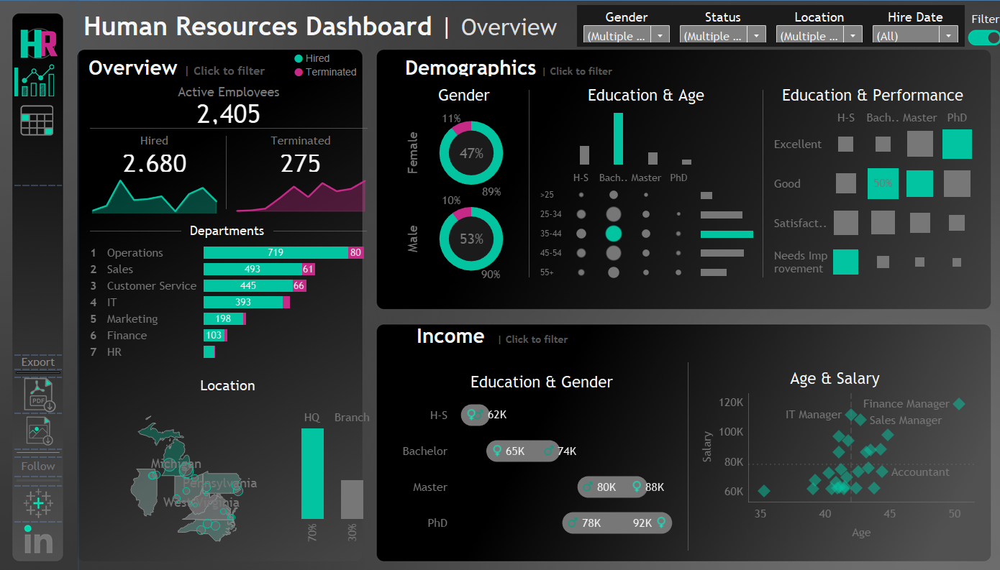
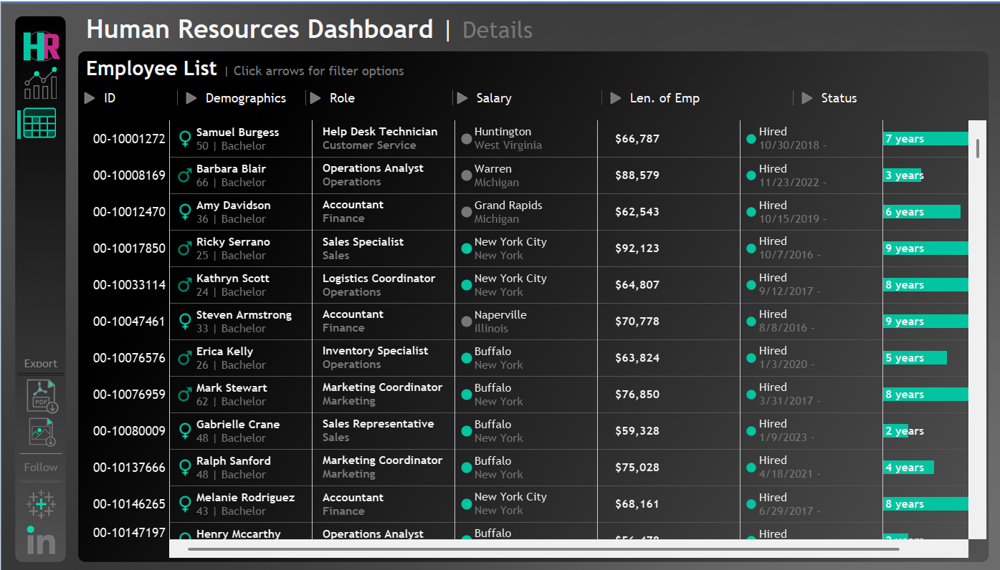

# HR Analytics

## 📋 Overview  
This interactive Tableau project visualizes workforce analytics such as employee turnover, salary distribution, gender balance, education levels, and performance trends.  
The dashboard provides HR and management teams with actionable insights into employee demographics, compensation, and retention.

---

## 🎯 Objective  
The goal of this project is to help HR leaders and analysts make data-driven decisions by uncovering workforce trends and performance patterns.  
Through interactive visualizations, the dashboard enables efficient monitoring of hiring, attrition, and employee development.

---

## 🧩 Dataset  
- **Records:** 8,950 employees  
- **Fields:** Employee ID, Gender, State, City, Education Level, Department, Job Title, Salary, Performance Rating, Hire/Termination Dates, Birthdate  
- **Source:** Simulated HR dataset for analytics demonstration  

---

## ⚙️ Tools & Techniques  
- **Tableau Desktop** – dashboard design, KPIs, filters, actions  
- **Excel / CSV** – data cleaning and preprocessing  
- **Python (Pandas)** – data validation and metric calculations  
- **KPIs Displayed:** Active Employees, Hired, Terminated, Tenure, Salary by Department, Performance Distribution  

---

## 📊 Key Insights  

### 👥 Workforce Overview  
- **Total employees:** 8,950  
- **Active employees:** 7,984  
- **Former employees:** 966  
- **Average age:** ~41.8 years  
> The workforce is largely mid-career with strong overall retention.

---

### ⚖️ Gender Distribution  
- **Male:** 53.6%  
- **Female:** 46.4%  
> Balanced gender ratio across most departments, reflecting a diverse and inclusive workforce.

---

### 🏢 Department Breakdown  
| Department | Employees |
|-------------|------------:|
| Operations | 2,718 |
| Sales | 1,835 |
| Customer Service | 1,673 |
| IT | 1,382 |
| Marketing | 718 |

> Operations and Sales account for nearly half the organization, showing its focus on client-facing and delivery roles.

---

### 💰 Average Salary by Department  
| Department | Avg. Salary (USD) |
|-------------|------------------:|
| IT | $81,926 |
| Finance | $76,451 |
| Sales | $76,205 |
| Marketing | $67,659 |
| Customer Service | $65,838 |

> IT professionals earn the highest average salaries, while Customer Service sits at the lower end, reflecting skill specialization and technical demand.

---

### ⭐ Performance Ratings  
| Rating | Percentage |
|---------|-------------:|
| Good | 42.0% |
| Satisfactory | 27.9% |
| Excellent | 17.5% |
| Needs Improvement | 12.5% |

> Most employees perform at “Good” or higher, though 12.5% need improvement—suggesting opportunities for training and performance support.

---

### ⏳ Tenure Insights  
- Most employees remain **3–5 years** before termination.  
- Strong retention is evident across mid-level roles and departments.

---

## 🎨 Dashboard Design & Navigation  

The HR Analytics Dashboard features **two interactive pages**:  

### 🧭 **Overview Page**
- **KPIs:** Active Employees, Hired, Terminated  
- **Trends:** Line graphs for hiring vs. termination over time  
- **Department Breakdown:** Horizontal bar charts showing hires vs. terminations  
- **Demographics Panel:**  
  - Gender ratio (Male vs. Female)  
  - Education & Age relationship  
  - Education & Performance correlation  
- **Income Section:** Salary comparison by education and gender  
- **Scatter Plot:** *Age vs. Salary* showing high-earning roles (e.g., Finance Manager, IT Manager)  
- **Location Map:** Displays workforce distribution across U.S. states and HQ vs. branch ratio  

### 🗂 **Details Page**
- **Employee Directory:** Interactive table with employee name, department, salary, location, tenure, and status  
- **Dynamic Filters:** Gender, Status, Location, Hire Date  
- **Color-coded Indicators:** Green for active, gray for terminated  
- **Interactive Tooltips:** Instant access to demographics and job info  

---

## 💡 Design Highlights  
- **Dark UI theme** with teal and magenta accent colors for readability and contrast  
- **Sidebar navigation** to toggle between Overview and Details pages  
- **Export options** for PDF reports  
- **Filter controls** for deep-dive analytics  
- **Responsive layout** designed for HR decision-makers  

---

## 🌐 View the Dashboard  
👉 [View on Tableau Public](https://public.tableau.com/app/profile/sam.sahami6751/viz/HRAnalyticsDashboard_17614168489320/HRDetails)

---

## 🖼️ Dashboard Preview  
**Overview Page:**  
 

**Details Page:**  

---

 

---

## 👤 Author  
**Sam Sahami**  
📧 Connect on [Tableau Public](https://public.tableau.com/app/profile/sam.sahami6751)  
💼 Data & Analytics Enthusiast | HR Insights | Visualization Design  

---

