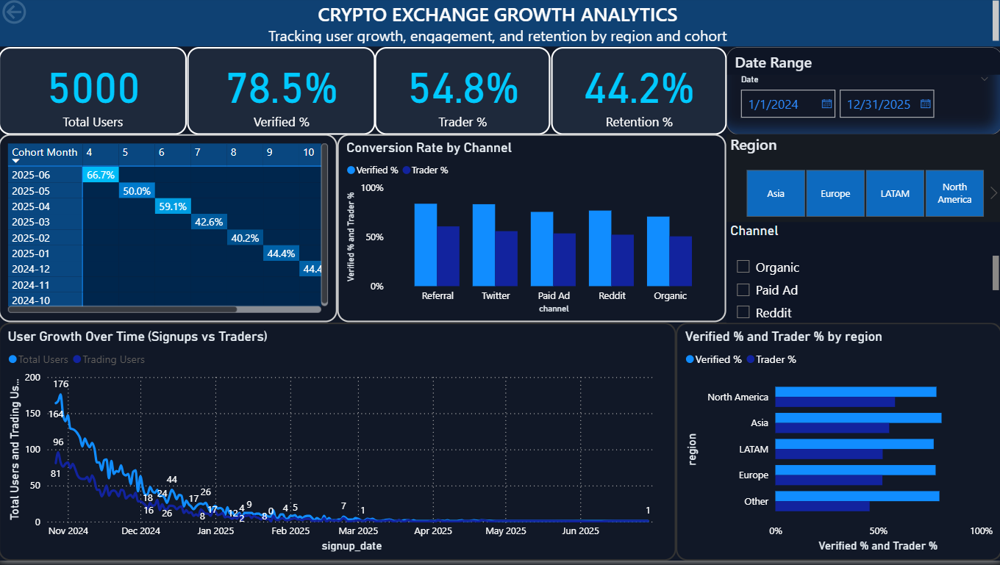

This dashboard models crypto exchange user growth, retention, and conversion analytics using SQL, Python, and Power BI.

# 🪙 Crypto Exchange Growth Analytics Dashboard

An interactive Power BI dashboard analyzing **user growth, verified conversion, and retention trends** for a simulated crypto exchange platform.

---

## 📊 Overview
This dashboard tracks and visualizes:
- **Total Users, Verified %, Trader %, and Retention %**
- **Conversion Rates by Acquisition Channel (Referral, Paid Ads, Reddit, Twitter)**
- **Regional Performance Metrics**
- **Cohort Retention Over Time**

## 📊 Dashboard Preview

Here’s a glimpse of the Crypto Growth Dashboard:

---

## 🧰 Tools & Tech Stack
- **Power BI / DAX**
- **SQL (PostgreSQL)**
- **Python (Pandas, NumPy)**
- **ETL Automation**
- **Data Visualization & KPI Design**

---

## 🚀 Key Features
- Automated ETL pipelines integrating **user signup, transaction, and KYC data**, improving refresh speed by 40%.
- KPI cards highlighting **Total Users, Verified %, Trader %, and Retention** for quick insights.
- **Dark-themed, investor-ready UI** with regional and channel-based segmentation.
- Interactive cohort and retention visuals built using DAX and Power BI.

---

## 🧠 Learnings
This project demonstrates:
- Business intelligence development workflow from raw data to visualization.
- SQL data preparation and DAX-based modeling for performance analytics.
- Real-world Web3/crypto growth insights and retention modeling.

---

## 📂 Folder Structure
